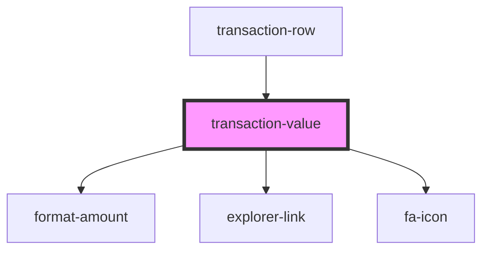

# transaction-value

<!-- Auto Generated Below -->

## Properties

| Property | Attribute | Description | Type                | Default               |
| -------- | --------- | ----------- | ------------------- | --------------------- |
| `class`  | `class`   |             | `string`            | `'transaction-value'` |
| `value`  | --        |             | `ITransactionValue` | `undefined`           |

## Dependencies

### Used by

 - [transaction-row](../transaction-row)

### Depends on

- [format-amount](../../../format-amount)
- [explorer-link](../../../explorer-link)
- [fa-icon](../../../fa-icon)

### Graph

----------------------------------------------

*Built with [StencilJS](https://stenciljs.com/)*
