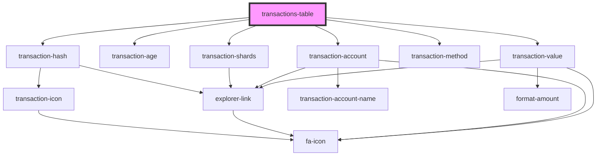

# transactions-table

<!-- Auto Generated Below -->

## Properties

| Property       | Attribute | Description | Type                      | Default     |
| -------------- | --------- | ----------- | ------------------------- | ----------- |
| `class`        | `class`   |             | `string`                  | `undefined` |
| `transactions` | --        |             | `ITransactionsTableRow[]` | `undefined` |

## Dependencies

### Depends on

- [transaction-hash](./components/transaction-hash)
- [transaction-age](./components/transaction-age)
- [transaction-shards](./components/transaction-shards)
- [transaction-account](./components/transaction-account)
- [transaction-method](./components/transaction-method)
- [transaction-value](./components/transaction-value)

### Graph

----------------------------------------------

*Built with [StencilJS](https://stenciljs.com/)*
