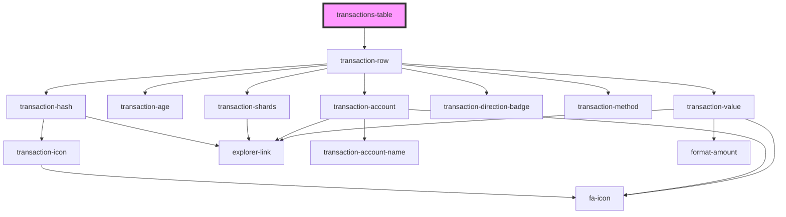

# transactions-table

<!-- Auto Generated Below -->

## Properties

| Property       | Attribute | Description | Type                      | Default                |
| -------------- | --------- | ----------- | ------------------------- | ---------------------- |
| `class`        | `class`   |             | `string`                  | `'transactions-table'` |
| `transactions` | --        |             | `ITransactionsTableRow[]` | `undefined`            |

## Dependencies

### Depends on

- [transaction-row](./components/transaction-row)

### Graph

----------------------------------------------

*Built with [StencilJS](https://stenciljs.com/)*
