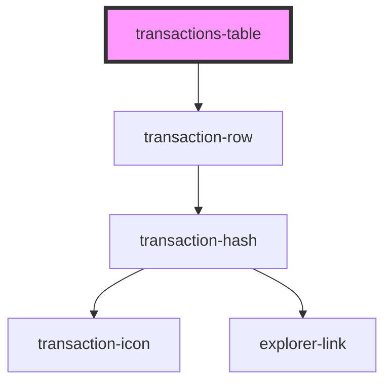

# transactions-table

<!-- Auto Generated Below -->

## Properties

| Property | Attribute | Description | Type     | Default     |
| -------- | --------- | ----------- | -------- | ----------- |
| `data`   | `data`    |             | `string` | `undefined` |

## Dependencies

### Depends on

- [transaction-row](./components/transaction-row)

### Graph

----------------------------------------------

*Built with [StencilJS](https://stenciljs.com/)*
