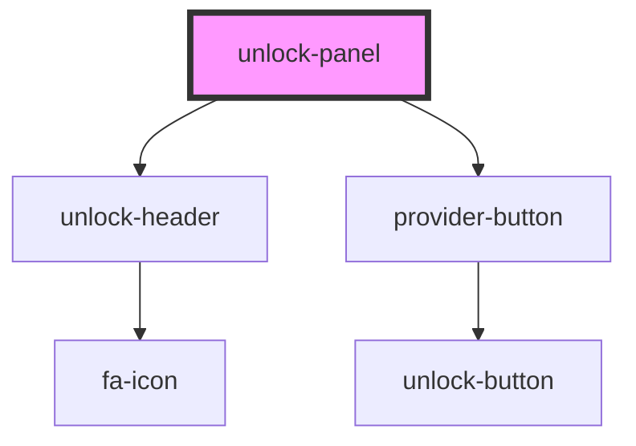

# side-panel

<!-- Auto Generated Below -->

## Properties

| Property           | Attribute | Description | Type                 | Default                           |
| ------------------ | --------- | ----------- | -------------------- | --------------------------------- |
| `allowedProviders` | --        |             | `ProviderTypeEnum[]` | `Object.values(ProviderTypeEnum)` |
| `open`             | `open`    |             | `boolean`            | `false`                           |

## Events

| Event   | Description | Type                                                                 |
| ------- | ----------- | -------------------------------------------------------------------- |
| `close` |             | `CustomEvent<any>`                                                   |
| `login` |             | `CustomEvent<{ provider: ProviderTypeEnum; anchor?: HTMLElement; }>` |

## Dependencies

### Depends on

- [unlock-header](./components/header)
- [provider-button](./components/provider-button)

### Graph

----------------------------------------------

*Built with [StencilJS](https://stenciljs.com/)*
