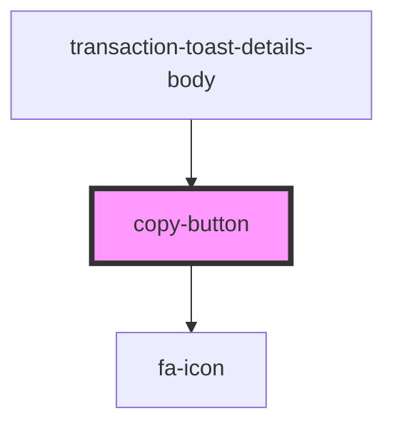

# copy-button

<!-- Auto Generated Below -->

## Properties

| Property      | Attribute    | Description | Type             | Default              |
| ------------- | ------------ | ----------- | ---------------- | -------------------- |
| `class`       | `class`      |             | `string`         | `'copy-button'`      |
| `copyIcon`    | --           |             | `IconDefinition` | `undefined`          |
| `iconClass`   | `icon-class` |             | `string`         | `'copy-button-icon'` |
| `successIcon` | --           |             | `IconDefinition` | `undefined`          |
| `text`        | `text`       |             | `string`         | `undefined`          |

## Dependencies

### Used by

 - [transaction-toast-details-body](../../functional/toasts-list/components/transaction-toast/components/transaction-toast-details/components)

### Depends on

- [fa-icon](../fa-icon)

### Graph

----------------------------------------------

*Built with [StencilJS](https://stenciljs.com/)*
