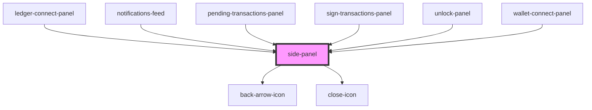

# side-panel

<!-- Auto Generated Below -->

## Properties

| Property         | Attribute          | Description | Type      | Default     |
| ---------------- | ------------------ | ----------- | --------- | ----------- |
| `isOpen`         | `is-open`          |             | `boolean` | `false`     |
| `panelClassName` | `panel-class-name` |             | `string`  | `undefined` |
| `panelTitle`     | `panel-title`      |             | `string`  | `undefined` |

## Events

| Event   | Description | Type               |
| ------- | ----------- | ------------------ |
| `back`  |             | `CustomEvent<any>` |
| `close` |             | `CustomEvent<any>` |

## Dependencies

### Used by

 - [ledger-connect-panel](../../functional/ledger-connect-components)
 - [notifications-feed](../../functional/notifications-feed)
 - [pending-transactions-panel](../../functional/pending-transactions-panel)
 - [sign-transactions-panel](../../functional/sign-transactions-panel)
 - [unlock-panel](../unlock-panel)
 - [wallet-connect-panel](../../functional/wallet-connect-components)

### Depends on

- [back-arrow-icon](../../../assets/icons/back-arrow-icon)
- [close-icon](../../../assets/icons/close-icon)

### Graph

----------------------------------------------

*Built with [StencilJS](https://stenciljs.com/)*
