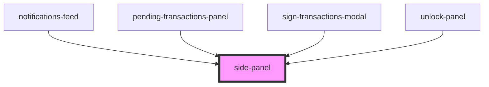

# side-panel

<!-- Auto Generated Below -->

## Properties

| Property         | Attribute          | Description | Type                                                | Default                   |
| ---------------- | ------------------ | ----------- | --------------------------------------------------- | ------------------------- |
| `isOpen`         | `is-open`          |             | `boolean`                                           | `false`                   |
| `panelClassName` | `panel-class-name` |             | `string`                                            | `undefined`               |
| `side`           | `side`             |             | `SidePanelSideEnum.LEFT \| SidePanelSideEnum.RIGHT` | `SidePanelSideEnum.RIGHT` |

## Events

| Event   | Description | Type               |
| ------- | ----------- | ------------------ |
| `close` |             | `CustomEvent<any>` |

## Dependencies

### Used by

 - [notifications-feed](../../functional/notifications-feed)
 - [pending-transactions-panel](../../functional/pending-transactions-panel)
 - [sign-transactions-modal](../../functional/sign-transactions-modal)
 - [unlock-panel](../unlock-panel)

### Graph

----------------------------------------------

*Built with [StencilJS](https://stenciljs.com/)*
