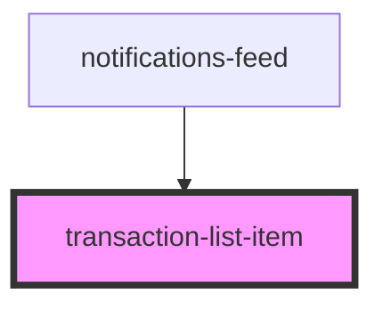

# transaction-list-item

<!-- Auto Generated Below -->

## Properties

| Property      | Attribute | Description | Type                   | Default     |
| ------------- | --------- | ----------- | ---------------------- | ----------- |
| `transaction` | --        |             | `ITransactionListItem` | `undefined` |

## Dependencies

### Used by

 - [notifications-feed](../../functional/notifications-feed)

### Graph

----------------------------------------------

*Built with [StencilJS](https://stenciljs.com/)*
