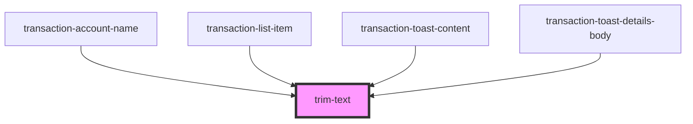

# trim-text

<!-- Auto Generated Below -->

## Properties

| Property     | Attribute      | Description | Type     | Default     |
| ------------ | -------------- | ----------- | -------- | ----------- |
| `class`      | `class`        |             | `string` | `undefined` |
| `dataTestId` | `data-test-id` |             | `string` | `undefined` |
| `text`       | `text`         |             | `string` | `undefined` |

## Dependencies

### Used by

 - [transaction-account-name](../../controlled/transactions-table/components/transaction-account/components/transaction-account-name)
 - [transaction-list-item](../transaction-list-item)
 - [transaction-toast-content](../../functional/toasts-list/components/transaction-toast/components/transaction-toast-content)
 - [transaction-toast-details-body](../../functional/toasts-list/components/transaction-toast/components/transaction-toast-details/components)

### Graph

----------------------------------------------

*Built with [StencilJS](https://stenciljs.com/)*
