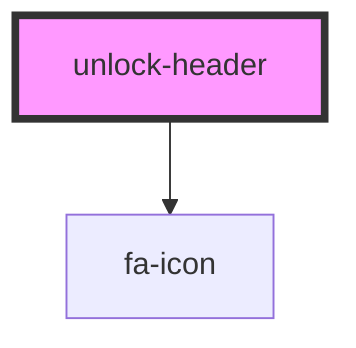

# unlock-header

<!-- Auto Generated Below -->

## Properties

| Property    | Attribute | Description | Type             | Default     |
| ----------- | --------- | ----------- | ---------------- | ----------- |
| `backIcon`  | --        |             | `IconDefinition` | `undefined` |
| `closeIcon` | --        |             | `IconDefinition` | `faTimes`   |
| `text`      | `text`    |             | `string`         | `undefined` |

## Events

| Event   | Description | Type                |
| ------- | ----------- | ------------------- |
| `back`  |             | `CustomEvent<void>` |
| `close` |             | `CustomEvent<void>` |

## Dependencies

### Depends on

- [fa-icon](../../../fa-icon)

### Graph

----------------------------------------------

*Built with [StencilJS](https://stenciljs.com/)*
