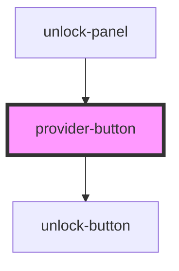

# connect-button

<!-- Auto Generated Below -->

## Properties

| Property | Attribute | Description | Type                                                                                                                                                                               | Default     |
| -------- | --------- | ----------- | ---------------------------------------------------------------------------------------------------------------------------------------------------------------------------------- | ----------- |
| `type`   | `type`    |             | `ProviderTypeEnum.crossWindow \| ProviderTypeEnum.extension \| ProviderTypeEnum.ledger \| ProviderTypeEnum.metamask \| ProviderTypeEnum.passkey \| ProviderTypeEnum.walletConnect` | `undefined` |

## Dependencies

### Used by

 - [unlock-panel](../..)

### Depends on

- [unlock-button](../../../../../common/unlock-button)

### Graph

----------------------------------------------

*Built with [StencilJS](https://stenciljs.com/)*
