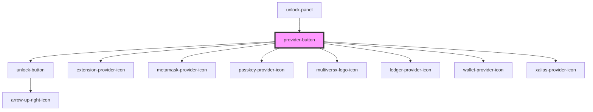

# connect-button

<!-- Auto Generated Below -->

## Properties

| Property | Attribute | Description | Type                                                                                                                                                                                                          | Default     |
| -------- | --------- | ----------- | ------------------------------------------------------------------------------------------------------------------------------------------------------------------------------------------------------------- | ----------- |
| `type`   | `type`    |             | `ProviderTypeEnum.crossWindow \| ProviderTypeEnum.extension \| ProviderTypeEnum.ledger \| ProviderTypeEnum.metamask \| ProviderTypeEnum.passkey \| ProviderTypeEnum.walletConnect \| ProviderTypeEnum.xalias` | `undefined` |

## Dependencies

### Used by

 - [unlock-panel](../..)

### Depends on

- [unlock-button](../../../../../common/unlock-button)
- [extension-provider-icon](../../../../../assets/icons/extension-provider-icon)
- [metamask-provider-icon](../../../../../assets/icons/metamask-provider-icon)
- [passkey-provider-icon](../../../../../assets/icons/passkey-provider-icon)
- [multiversx-logo-icon](../../../../../assets/icons/multiversx-logo-icon)
- [ledger-provider-icon](../../../../../assets/icons/ledger-provider-icon)
- [wallet-provider-icon](../../../../../assets/icons/wallet-provider-icon)
- [xalias-provider-icon](../../../../../assets/icons/xalias-provider-icon)

### Graph

----------------------------------------------

*Built with [StencilJS](https://stenciljs.com/)*
